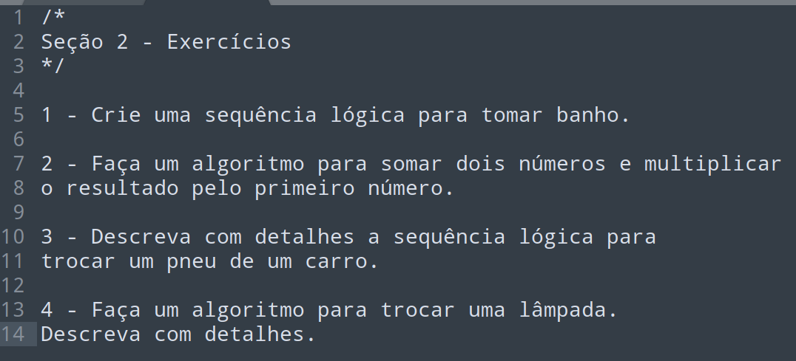
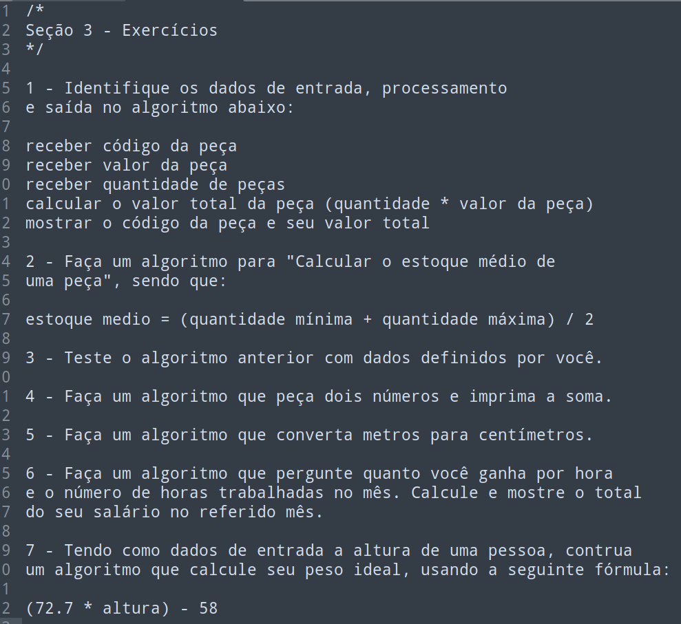
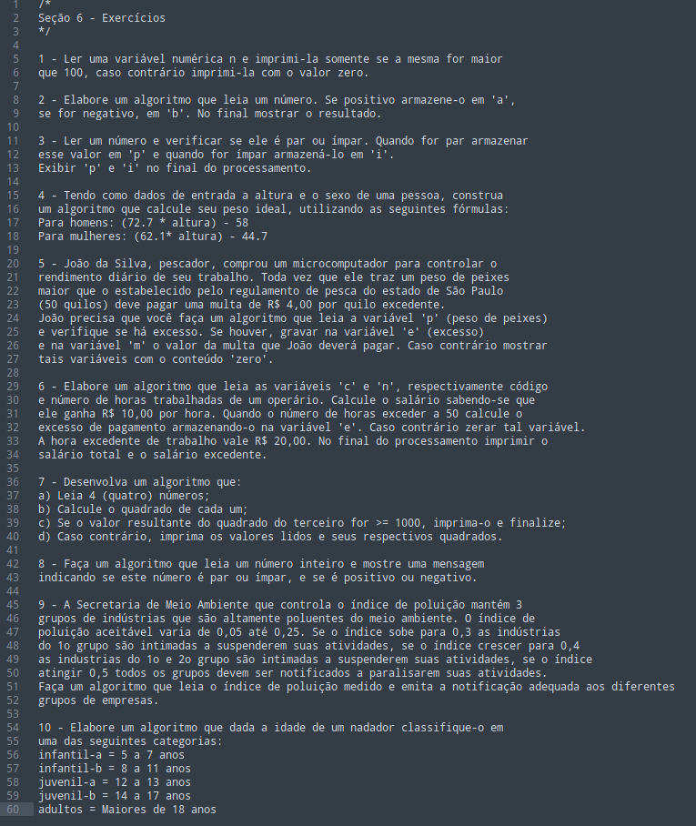
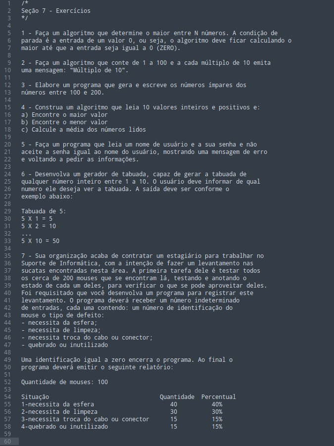
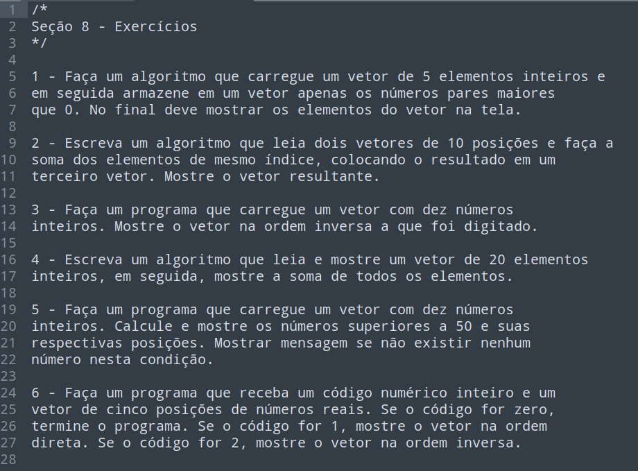

# Solved exercises from Geek University's Algorithm and Programming Logic course

Solved exercises in C and Java for study purposes.

Click [here](https://www.udemy.com/course/algoritmos-e-logica-de-programacao-essencial/) to access the course mentioned (PT-BR).

## TO DO

- Solve exercises in Python.

## Exercises list
Exercises in PT-BR language.

### Section 2

### Section 3

### Section 6

### Section 7

### Section 8

